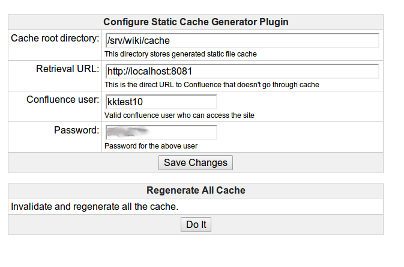

Confluence Static Cache Generator
=================================

I'm not sure about your Confluence, but [my Confluence](http://wiki.jenkins-ci.org/) is dog slow. Page rendering regularly
takes a second or two, or even worse. That's why I wrote this plugin.

This Confluence plugin generates static HTML files out of your Wiki pages.
It happens every time when someone updates a page, post a comment, add a label &mdash; anything that can affect
the way the page looks in Confluence.

Unlike [Auto-export plugin](https://marketplace.atlassian.com/plugins/com.atlassian.confluence.extra.autoexport),
this plugin doesn't try to apply a different theme, or help you make them look like non-Wiki sites. HTML files
generated by this plugin is a straight capture of what Confluence is rendering.

These generated files can be then served from frontend Apache reverse proxy. With the use of `mod_rewrite`, Apache
will act as a smart caching proxy; it'll serve static HTML files if they exist, and otherwise it'll forward the requests
to the backend Confluence.

The end result is that your visitors won't even notice that your Confluence is running with static cache. They see
the same-old Confluence UI, and the same URLs will keep working. The only difference is that pages magically load
a lot faster.

Installing and configuring this plugin
--------------------------------------
[Download the binary]() and deploy it to Confluence. The configuration UI will appear in the Confluence administration page.

You'll specify the local directory to store generated HTML files, and username/password that the crawler will use
to retrieve pages. The botton at the bottom allows you to initiate full regeneration of the cache (which happens
automatically every 6 hours.) When you initially set up this plugin, you want to press this button to get the cache
populated.

### Configuring Apache

The next part of the setup is to configure front-end Apache to serve the static HTML files when they are present.

The first thing you need is a shell script that tells Apache if there's a cache file or not. We'll use this
from [mod_rewrite RewriteMap](http://httpd.apache.org/docs/current/mod/mod_rewrite.html#rewritemap). Make
this script executable to Apache and save it somewhere.

    #!/bin/bash

    # this is where we store the generated cache
    cd /srv/wiki/cache

    while read F; do
      # unescape
      F=$(echo $F | tr '+' ' ')

      if [ -f "./$F.html" ]; then
        echo cache/$F.html
      else
        echo $F
      fi
    done

Then the following configuration fragment was added to Apache (in the appropriate `<VirtualHost>` directive:

    DocumentRoot /srv/wiki/cache

    RewriteEngine On

    # load the mapping table, which is a program
    RewriteMap cache prg:/srv/wiki/cache/check_cache.sh
    RewriteMap escape int:escape

    # bypass the cache if there's some query string
    RewriteCond %{QUERY_STRING} =""
    # is it cached or not? if cached, serve from cache
    RewriteRule ^/display/(.+) /display/${cache:${escape:$1}} [C]
    RewriteRule ^/display/cache/(.*) /$1 [L]

    # otherwise proxy all the requests to the backend
    RewriteRule ^/(.*)$     http://localhost:8081/$1 [L,P]

    ## Debug mod_rewrite if needed
    # RewriteLogLevel 9
    # RewriteLog "/tmp/rewrite.log"

    RewriteLock /var/run/apache2.rewrite.lock

`/srv/wiki/cache/check_cache.sh` is the above shell script. What the above rules is doing is:

* we pass the request URL into `check_cache.sh` stdin and that script checks if we have
  a static HTML file for it. The Confluence plugin creates a file in the right name,
  and delete them when they get edited (which get regenerated in a few seconds.)

* if the script finds the cache, it maps the request to `/display/cache/SPACE/Page` URL.
  The next `RewriteRule` tells Apache to serve this file locally.

* if the script doesn't find the cache, another `RewriteRule` maps the request to
  reverse proxy to `http://localhost:8081/` which is where Confluence is running.

Inner working of the code
-------------------------

To prevent overloading Confluence, requsts to generate static cache files get queued and only
one thread acts on it. There's also artificial 3 seconds wait period between the page modification
event to the triggering of static cache generation, to ensure whatever changes that are going on
in Confluence fully hits the database before the crawler reads the page.

The cache gets deleted immediately when a page is modified.

The crawler uses a dedicated user account to crawl the page, so the captured HTML will contain
some trace of this user name. The crawler post-process HTML to remove these traces. In particular,
the user name that appears at the top-right corner of the page gets clobbered.

Excluding a page from cache
---------------------------
You can exclude individual pages from getting cached by adding `nocache` label to the page.
This is useful if the page contains dynamic content that requires real-time update.

How to hack the code
--------------------
Here are the SDK commands you'll use immediately:

* atlas-run   -- installs this plugin into Confluence and starts it on `http://localhost:1990/confluence`
* atlas-debug -- same as atlas-run, but allows a debugger to attach at port 5005
* atlas-cli   -- after atlas-run or atlas-debug, opens a Maven command line window:
                 - 'pi' reinstalls the plugin into the running Confluence instance
* atlas-help  -- prints description for all commands in the SDK

Full documentation is at https://developer.atlassian.com/display/DOCS/Developing+with+the+Atlassian+Plugin+SDK
